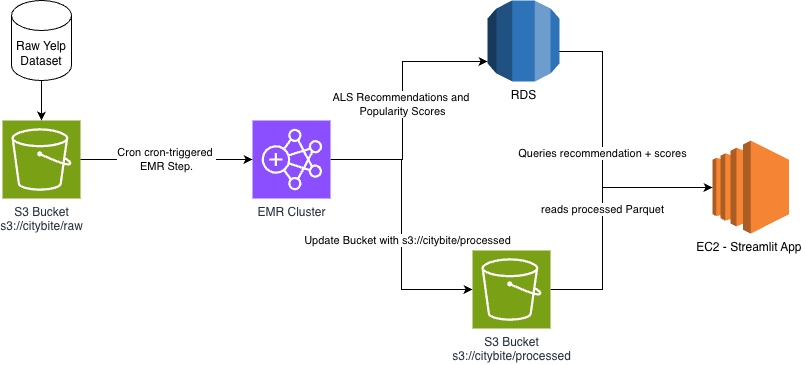

# CityBite

Restaurant popularity intelligence platform built on AWS. Processes 7M+ Yelp reviews through a two-zone S3 data lake on Amazon EMR, trains a Spark MLlib ALS recommender and scikit-learn sentiment classifier, and serves results through a Streamlit + Folium dashboard on EC2.

## Architecture



## Repo Structure

```
citybite/
├── pipeline/
│   ├── upload.py          # Boto3 multipart upload → S3 raw zone
│   ├── clean_job.py       # PySpark: raw → enriched reviews (partitioned by city)
│   ├── aggregate_job.py   # Spark SQL: popularity scores + grid aggregates → RDS
│   └── submit_emr.py      # Launch transient EMR cluster (spot instances, auto-terminates)
├── ml/
│   ├── als_train.py       # Spark MLlib ALS recommender (top-10 per user)
│   ├── sentiment.py       # scikit-learn TF-IDF + LogisticRegression sentiment
│   └── evaluate.py        # RMSE, precision@k evaluation
├── dashboard/
│   └── app.py             # Streamlit app: Folium heatmap + rec panel + sentiment
├── infra/
│   ├── create_rds.py      # Provision RDS PostgreSQL (db.t3.micro, free-tier eligible)
│   ├── schema.sql         # 4-table PostgreSQL schema
│   └── cron_setup.sh      # Nightly cron on EMR master node
├── data/
│   └── sample/
│       └── generate_sample.py  # Generate synthetic Yelp data for local dev
├── downloaded_data/             # Real Yelp JSON files (gitignored, ~9 GB)
├── tests/
│   ├── test_clean_job.py  # 12 PySpark unit tests (local mode, no AWS)
│   ├── test_upload.py     # 8 S3 upload tests (moto mock)
│   └── test_submit_emr.py # 9 EMR submission tests (unittest.mock)
├── notebooks/
│   └── analysis.ipynb     # ALS + sentiment analysis notebook
├── requirements.txt
└── .env.example
```

## Prerequisites

- Python 3.10+
- Java 11 (required for PySpark): `export JAVA_HOME=/usr/lib/jvm/java-11-openjdk-amd64`
- AWS CLI configured: `aws configure`

## Setup

```bash
pip install -r requirements.txt
cp .env.example .env   # fill in your AWS credentials
```

## Local Development (no AWS required)

Generate synthetic sample data and run the pipeline locally:

```bash
# 1. Generate sample data (~300 businesses, 3000 reviews)
python data/sample/generate_sample.py

# 2. Run the cleaning job in local mode
spark-submit pipeline/clean_job.py \
  --input data/sample/ \
  --output data/processed/ \
  --mode local

# 3. Run tests (no AWS needed)
pytest tests/ -v
```

## Downloading the Yelp Dataset

The full dataset (~9 GB uncompressed) is required for the AWS pipeline. The zip contains several folders; only `yelp_dataset/` is needed.

```bash
# 1. Download the zip (~4 GB, takes a few minutes)
curl -L -o Yelp-JSON.zip https://business.yelp.com/external-assets/files/Yelp-JSON.zip

# 2. Create the target directory
mkdir -p downloaded_data

# 3. Extract only the yelp_dataset folder
unzip Yelp-JSON.zip 'yelp_dataset/*'

# 4. Move its contents into downloaded_data/ and clean up
mv yelp_dataset/* downloaded_data/
rm -rf yelp_dataset Yelp-JSON.zip
```

After this, `downloaded_data/` should contain:

```
downloaded_data/
├── yelp_academic_dataset_business.json   (~120 MB)
├── yelp_academic_dataset_review.json     (~6.5 GB)
├── yelp_academic_dataset_user.json       (~3.3 GB)
└── yelp_academic_dataset_checkin.json
```

> `downloaded_data/` and `Yelp-JSON.zip` are gitignored — never commit them.

---

## AWS Infrastructure Setup

### Step 1 — S3 bucket

```bash
aws s3 mb s3://citybite --region us-east-1
```

### Step 2 — Upload Yelp data

```bash
python pipeline/upload.py --source downloaded_data/ --bucket citybite --prefix raw/
```

### Step 3 — Provision RDS (free-tier eligible)

```bash
python infra/create_rds.py          # provisions db.t3.micro, prints endpoint
# Copy the printed endpoint into .env as RDS_HOST
psql -h $RDS_HOST -U $RDS_USER -d $RDS_DB -f infra/schema.sql
```

### Step 4 — Run pipeline on EMR (transient cluster)

No cluster to manage — each run spins up, executes, and terminates automatically. Core nodes use spot instances.

```bash
# Run both jobs on a single transient cluster (~$2-4 total)
python pipeline/submit_emr.py clean aggregate

# Or run individually
python pipeline/submit_emr.py clean
python pipeline/submit_emr.py aggregate

# Use an existing long-running cluster instead
python pipeline/submit_emr.py --job clean --cluster-id j-XXXX --wait
```

Logs land at `s3://citybite/logs/emr/<cluster-id>/`.

### Step 5 — Train ML models

```bash
spark-submit ml/als_train.py --input data/processed/ --mode local   # local
spark-submit ml/als_train.py --input s3://citybite/processed/        # EMR
python ml/sentiment.py
```

### Step 6 — Run dashboard

```bash
streamlit run dashboard/app.py
```

## Cost Estimate (3-week class project)

| Service | Config | Estimated cost |
|---|---|---|
| S3 | ~12 GB stored | ~$0.50 |
| RDS | db.t3.micro, free tier | $0 (or ~$2/demo week) |
| EMR | Transient, spot core nodes, ~5 runs | ~$10–15 |
| EC2 dashboard | t3.micro (demo week only) | ~$2 |
| **Total** | | **~$12–20** |

> The transient cluster mode (`KeepJobFlowAliveWhenNoSteps=False`) prevents runaway charges from forgetting to terminate a cluster.

## S3 Zone Layout

```
s3://citybite/
├── raw/
│   ├── business/yelp_academic_dataset_business.json
│   ├── review/yelp_academic_dataset_review.json
│   └── user/yelp_academic_dataset_user.json
├── processed/
│   ├── reviews_enriched/city=Phoenix/
│   ├── business_scores/city=Phoenix/
│   ├── grid_aggregates/city=Phoenix/
│   └── user_item_matrix/
├── scripts/          ← pipeline scripts auto-uploaded by submit_emr.py
└── logs/emr/         ← EMR step logs
```

## Database Schema

| Table | Key columns | Written by |
|---|---|---|
| `business_scores` | `business_id`, `popularity_score`, `grid_cell` | `aggregate_job.py` |
| `grid_aggregates` | `grid_cell`, `avg_popularity`, `restaurant_count` | `aggregate_job.py` |
| `als_recommendations` | `user_id`, `business_id`, `predicted_rating` | `als_train.py` |
| `grid_sentiment` | `grid_cell`, `sentiment_score` | `sentiment.py` |

## Environment Variables

| Variable | Description |
|---|---|
| `AWS_ACCESS_KEY_ID` | AWS credentials |
| `AWS_SECRET_ACCESS_KEY` | AWS credentials |
| `AWS_REGION` | Default: `us-east-1` |
| `S3_BUCKET` | Bucket name, default: `citybite` |
| `EMR_CLUSTER_ID` | Only needed for persistent-cluster mode |
| `RDS_HOST` | RDS endpoint (printed by `create_rds.py`) |
| `RDS_PORT` | Default: `5432` |
| `RDS_DB` | Default: `citybite` |
| `RDS_USER` | Default: `citybite_user` |
| `RDS_PASSWORD` | Set in `.env`, never commit |

## Common Issues

**PySpark can't find Java**
```bash
export JAVA_HOME=/usr/lib/jvm/java-11-openjdk-amd64
export PATH=$JAVA_HOME/bin:$PATH
```

**EMR job fails with permissions error** — attach `AmazonS3FullAccess` and `AmazonRDSFullAccess` to the EMR EC2 instance profile.

**RDS connection refused from EMR** — add inbound rule to the RDS security group allowing port 5432 from the EMR master node's security group.

**ALS returns NaN predictions** — `coldStartStrategy="drop"` is set in `als_train.py`; verify the training set covers the users/items you're predicting.

**Folium map blank in Streamlit** — use `st_folium(m, width=700)` from `streamlit-folium`, not `folium_static()`.
